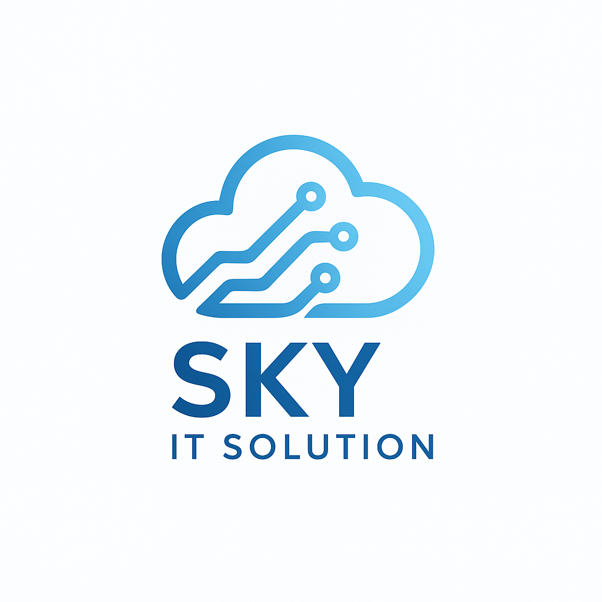

<!-- Organization Profile README for SKY IT SOLUTION -->

  

<h1 align="center">SKY IT SOLUTION</h1>

<strong>Cloud‑first engineering. Secure. Scalable. Supported.</strong>

  
  

---

## About
SKY IT SOLUTION is a technology‑first solutions company building secure, scalable cloud and application platforms for modern businesses. We combine DevOps excellence, robust server management, full‑stack application development, and cybersecurity expertise to deliver production‑ready systems — fast.

## ⭐ What we do

### Cloud & DevOps
- Containerization: **Docker**
- Orchestration: **Kubernetes**
- GitOps & CD: **Argo CD**
- Cloud: **AWS · GCP · Azure**

### Server & Infrastructure Management
- Linux (**Ubuntu**, **AlmaLinux**), **Windows Server**
- Monitoring, backup, hardening, and incident response

### Application Development
- **Mobile:** Kotlin, Flutter, React Native, Swift
- **Web:** Next.js, Angular, Node.js, NestJS, Django, Spring Boot
- **CMS:** WordPress development & custom plugins

### Application Maintenance & Support
- SLA‑driven maintenance, performance tuning, patching

### Cybersecurity & Pentesting Consultancy
- Tools: **Burp Suite, Nessus, Nuclei, Amass, Hydra, Nmap, Kali Linux, Metasploit**
- Vulnerability discovery, risk assessment, remediation planning

## 🧰 Tech & Tools (representative)

## 🔒 Security & Compliance
Security is built into everything we deliver: secure configurations, least‑privilege defaults, CI/CD safety gates, automated scanning, and regular pentests. We help clients meet regulatory and internal compliance requirements.

## 🚀 Getting started (for partners & clients)
1. **Discovery & Assessment** — Architecture review and quick‑wins.
2. **Roadmap & Proposal** — Prioritized improvements with timelines and SLAs.
3. **Build & Migrate** — IaC, containerization, and cloud/hybrid migrations.
4. **Operate & Improve** — 24/7 support, runbooks, observability, and continuous security testing.

## 📂 Showcase (recommended)
> Pin repositories below to highlight flagship projects, templates, and tooling.
- `infra/` — Terraform / Helm charts / Argo CD apps  
- `platform/` — Kubernetes platform & operator configs  
- `apps/` — Example web & mobile applications  
- `pentest/` — Safe demo scripts & scanning configs (no sensitive data)

## 🤝 Work with us
- **Website:** https://skyitsolution.co.im  
- **Email:** admin@skyitsolution.co.in  
- **LinkedIn:** https://www.linkedin.com/company/108054999

## ✨ Contribute
We welcome open collaboration. For external contributors: fork → branch → PR with tests and a clear description. See `CONTRIBUTING.md` for coding standards and security reporting (add to this repo).

## License
Add your organization license (e.g., `MIT` or `Proprietary - All Rights Reserved`). Include a `LICENSE` file in the repo.
