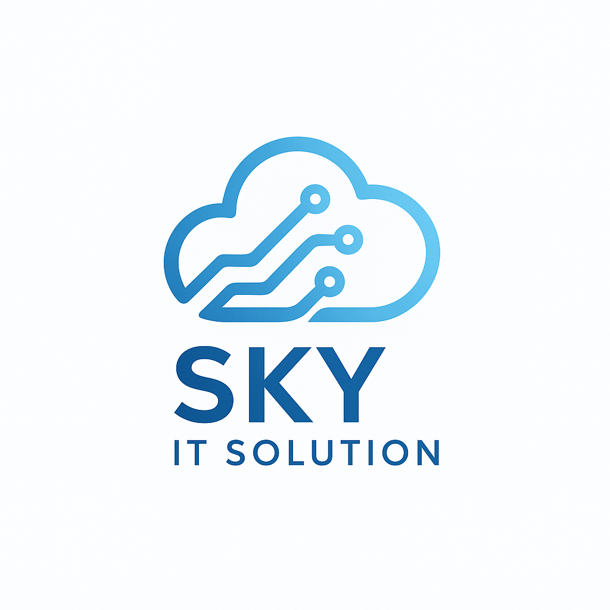

<!-- SKY IT SOLUTION | Organization Profile -->

  

<h1 align="center">🚀 SKY IT SOLUTION</h1>

<strong>Cloud-first engineering. Secure. Scalable. Supported.</strong>

  
  

---

## 🌐 About Us

<b>SKY IT SOLUTION</b> is a next-generation IT engineering company specializing in **cloud-native development, DevOps automation, managed services, and cybersecurity**.

We blend **enterprise reliability** with **startup agility** to deliver scalable platforms, secure applications, and long-term digital innovation.

> ⚡ We turn ideas into reliable, production-grade systems — fast, secure, and future-proof.

---

## 💼 Services & Expertise

### ☁️ Cloud & DevOps
- Containers (Docker), Orchestration (Kubernetes)
- CI/CD & GitOps (Argo CD)
- Cloud Platforms — AWS · GCP · Azure
- Infrastructure as Code · Monitoring · Automation

### 🖥️ Infrastructure & Server Management
- Linux (Ubuntu, AlmaLinux) · Windows Server
- Monitoring, Backup, Hardening, Incident Response

### 📱 Application Development
- **Mobile:** Kotlin · Flutter · React Native · Swift  
- **Web:** Next.js · Angular · Node.js · NestJS · Django · Spring Boot  
- CMS & Custom Modules: WordPress

### 🔧 Application Maintenance
- SLA-based managed support  
- Performance tuning · Patch & release cycles

### 🛡️ Cybersecurity & Pentesting
- Tools: Burp Suite · Nessus · Nmap · Metasploit · Nuclei · Hydra · Kali Linux · Amass
- Vulnerability Scans · Application Security · Security Consulting

---

## 🧰 Tech & Tools

<table>
  <tr>
    <td align="center" width="90"> <b>Docker</b></td>
    <td align="center" width="90"> <b>K8s</b></td>
    <td align="center" width="90"> <b>AWS</b></td>
    <td align="center" width="90"> <b>GCP</b></td>
    <td align="center" width="90"> <b>Azure</b></td>
    <td align="center" width="90"> <b>Ubuntu</b></td>
    <td align="center" width="90"> <b>Next.js</b></td>
    <td align="center" width="90"> <b>React</b></td>
  </tr>
  <tr>
    <td align="center" width="90"> <b>Node.js</b></td>
    <td align="center" width="90"> <b>Spring</b></td>
    <td align="center" width="90"> <b>Django</b></td>
    <td align="center" width="90"> <b>Flutter</b></td>
    <td align="center" width="90"> <b>Kotlin</b></td>
    <td align="center" width="90"> <b>Swift</b></td>
    <td align="center" width="90"> <b>WordPress</b></td>
    <td align="center" width="90"> <b>Laravel</b></td>
  </tr>
</table>

---

## 🔒 Security & Compliance

✔ Secure-by-default configs  
✔ CI/CD security gates  
✔ Automated vulnerability scans  
✔ Regular pentesting & compliance audits  

> Our mission: **secure innovation without friction.**

---

## 🚀 Partner Workflow

| Phase | Deliverables |
|-------|-------------|
| Discovery | Architecture, audit, roadmap |
| Design | Tech plan, diagrams, timeline |
| Build & Deploy | IaC, pipelines, infra, apps |
| Operate | 24/7 monitoring, updates, support |

---

## 📂 Showcase Ideas
Pin these repositories for a polished org page:

| Folder | Purpose |
|--------|--------|
`infra/` | Terraform, Helm, Argo CD |
`platform/` | Kubernetes platform assets |
`apps/` | Web & mobile examples |
`pentest/` | Sample ethical security configs |

---

## 📬 Contact

| Type | Info |
|---|---|
🌐 Website | https://skyitsolution.co.in  
📧 Email | admin@skyitsolution.co.in  
🔗 LinkedIn | https://www.linkedin.com/company/108054999  

---

## 🤝 Contributions
We love collaboration —  
✅ Fork → Branch → PR → Merge  
📩 Security issues: email us privately

---

<!-- ## 📜 License
Add a license (`MIT` / `Proprietary`) in `/LICENSE`.

--- -->

<i>Made with 💙 by SKY IT SOLUTION</i>

