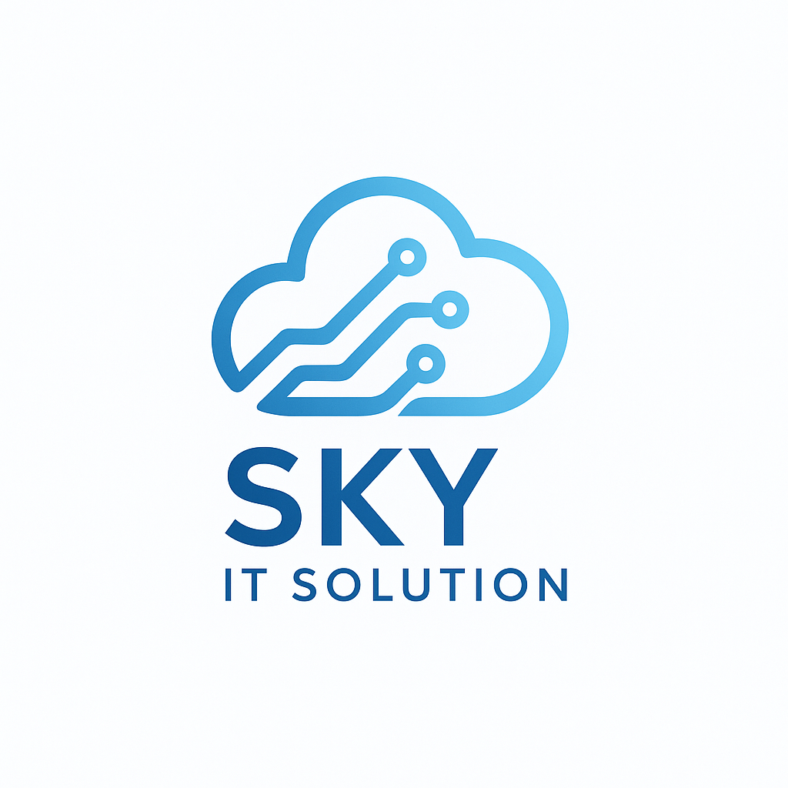
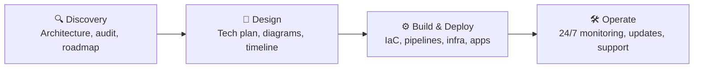

<!-- SKY IT SOLUTION | Organization Profile -->

# SKY IT SOLUTION

### ☁️ Cloud-first engineering. Secure. Scalable. Supported.

  <em>We turn ideas into reliable, production-grade systems — fast, secure, and future-proof.</em>

  
  
  

---

## 🌐 About Us

**SKY IT SOLUTION** is a next-generation IT engineering company specializing in **cloud-native development, DevOps automation, managed services, and cybersecurity**.

We blend **enterprise reliability** with **startup agility** to deliver scalable platforms, secure applications, and long-term digital innovation — based out of Kolkata, serving clients across India and beyond.

| 🎯 Focus | 🚀 Approach | 🛡️ Promise |
|:---:|:---:|:---:|
| Cloud & DevOps-first delivery | Startup-speed execution | Security baked in, not bolted on |

---

## 💼 Services & Expertise

<table width="100%">
<tr>
<td width="50%" valign="top">

### ☁️ Cloud & DevOps
- Containers (Docker) · Orchestration (Kubernetes)
- CI/CD & GitOps (Argo CD)
- Cloud Platforms — AWS · GCP · Azure
- Infrastructure as Code · Monitoring · Automation

### 🖥️ Infrastructure & Server Management
- Linux (Ubuntu, AlmaLinux) · Windows Server
- Monitoring, Backup, Hardening, Incident Response

</td>
<td width="50%" valign="top">

### 📱 Application Development
- **Mobile:** Kotlin · Flutter · React Native · Swift
- **Web:** Next.js · Angular · Node.js · NestJS · Django · Spring Boot
- CMS & Custom Modules: WordPress

### 🛡️ Cybersecurity & Pentesting
- Burp Suite · Nessus · Nmap · Metasploit · Nuclei · Hydra · Kali Linux · Amass
- Vulnerability Scans · App Security · Security Consulting

</td>
</tr>
</table>

### 🔧 Application Maintenance
SLA-based managed support · Performance tuning · Patch & release cycles

---

## 🧰 Tech & Tools

---

## 🔒 Security & Compliance

| ✔ Secure-by-default configs | ✔ CI/CD security gates | ✔ Automated vulnerability scans | ✔ Regular pentests & audits |
|:---:|:---:|:---:|:---:|

> 🛡️ **Our mission:** secure innovation without friction.

---

## 🚀 Partner Workflow

```mermaid
flowchart LR
    A["🔍 Discovery<br/>Architecture, audit, roadmap"] --> B["🎨 Design<br/>Tech plan, diagrams, timeline"]
    B --> C["⚙️ Build & Deploy<br/>IaC, pipelines, infra, apps"]
    C --> D["🛠️ Operate<br/>24/7 monitoring, updates, support"]
```

---

## 📂 Showcase Repositories

| Folder | Purpose |
|--------|---------|
| `infra/` | Terraform, Helm, Argo CD |
| `platform/` | Kubernetes platform assets |
| `apps/` | Web & mobile examples |
| `pentest/` | Sample ethical security configs |

---

## 📬 Get in Touch

| 🌐 Website | 📧 Email | 🔗 LinkedIn |
|:---:|:---:|:---:|
| [skyitsolution.co.in](https://skyitsolution.co.in) | [admin@skyitsolution.co.in](mailto:admin@skyitsolution.co.in) | [SKY IT SOLUTION](https://www.linkedin.com/company/108054999) |

---

## 🤝 Contributions

✅ Fork → Branch → PR → Merge
📩 **Security issues?** Please email us privately rather than opening a public issue.

<!--
## 📜 License
Add a license (`MIT` / `Proprietary`) in `/LICENSE`.
-->

<i>Made with 💙 by SKY IT SOLUTION</i>

